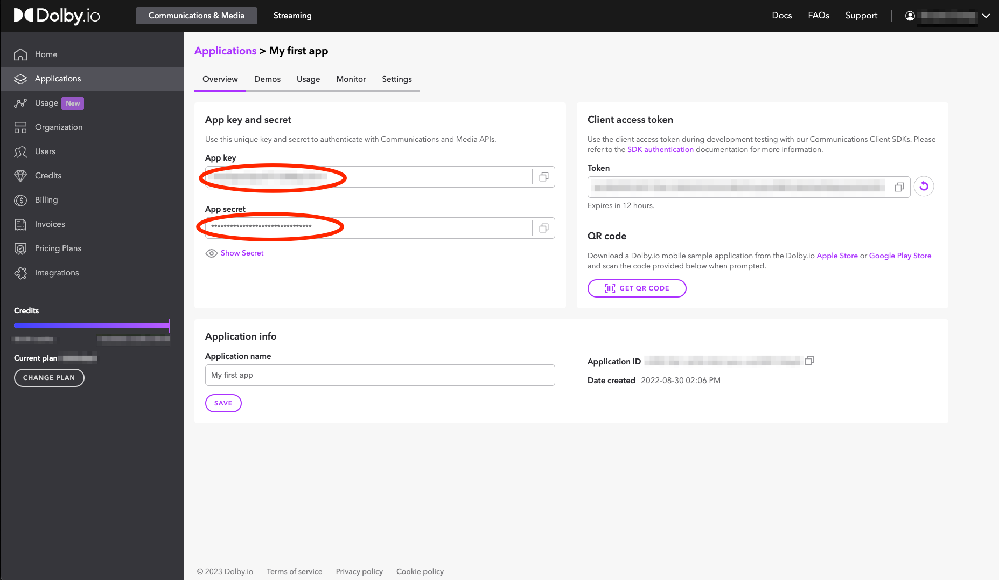

# Additional Configuration Options for the Video Call App

## Base URL configuration

In the event that you need to serve production content from a path other than `/` root, (e.g. extend example.app to example.app/videoconference/) please add the `/.env.production` file with the following content:

```bash
BASE_URL=<YOUR BASE URL PATH>
```

Additional information about Base URL configuration can be found [here](https://vitejs.dev/config/shared-options.html#base).

## Setting up music mode

1. In the project root folder, add the following variable in `.env` file:

```env
VITE_MUSIC_MODE=true
```

2. To start the application run the following command in the **root** directory

```bash
yarn dev
```

## Using live streaming features

In order to use live streaming features, you need to run an additional proxy server so that POST methods can be properly handled. An example of such a server is placed in the [/api](api/) folder.

> If your application has been started in previous steps, please kill the process and proceed with instructions below.

### Setting up live streaming

1. In the project root folder, create an `.env` file and add the following variables

```env
VITE_API_PROXY=localhost
VITE_PROXY_PORT=4000
VITE_PROXY_PROTOCOL=http
VITE_STREAMING=true
```

2. In the `/api` directory, create an `.env` file and fill it with the following properties.

```bash
PORT=4000
KEY=APP_KEY
SECRET=APP_SECRET
HOSTNAME=localhost
```

Your `APP_KEY` and `APP_SECRET` can be found in your Dolby.io dashboard, under the app section. **Do not** wrap them in quote marks.



3. Staying inside the `/api` directory, install all dependencies by running the following command

```bash
yarn
```

1. To start both the server and application together, run the following command in the **root** directory:

```bash
yarn run dev-proxy
```

>You can set any value for port and hostname in the .env files, as long as they are the same.

## Adding Custom layouts to your live stream

Please visit this [blog post](https://dolby.io/blog/creating-a-custom-mixer-layout-for-streaming-a-conference/) if you want to explore adding a custom layout to your live stream.
